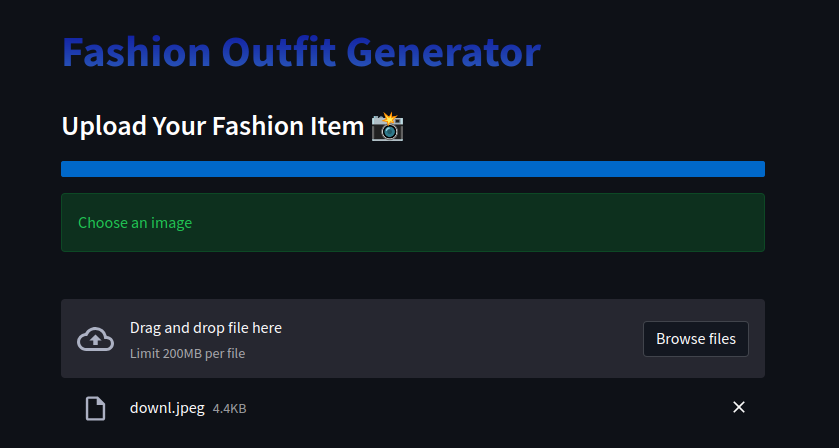
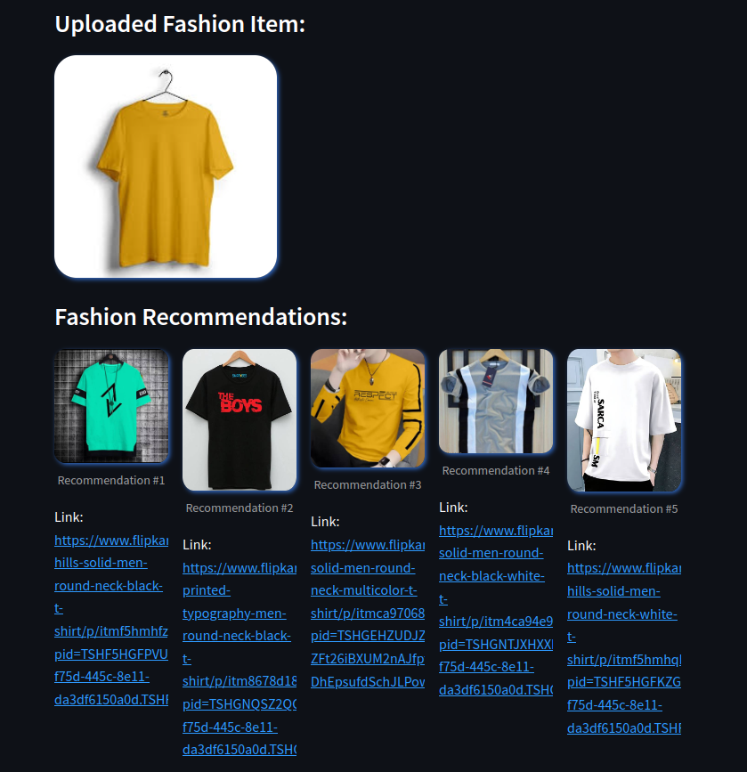

# GEN_AI_FC

# CYB3R
### Purpose

- Create an easy-to-use application for fashion suggestions.
- Use purchase history to offer tailored recommendations.
- Incorporate latest trends from platforms like Instagram.
- Generate outfits that match preferences and occasions.
- Allow users to adjust outfits based on feedback.
- Utilize advanced NLP to understand user likes.
- Design an engaging experience that boosts confidence.
- Securely manage user data for efficient access.
- Follow privacy rules, provide data choices.
- Test and refine AI model using real interactions.
- Provide guides for developers and customer service.
- Build scalable setup, optimize AI responsiveness.

## Installation

Use pip to install the requirements.

~~~bash
pip install -r requirements.txt
~~~

## Results



## Usage

Run web_scrapper.py to extract data from websites such as Flipkart, Vogue, Myntra:
```bash
python web_scrapper.py
```

Run image_downloader.py to download image via links extracted previously:
```bash
python image_downloader.py
```


To build embeddings, run hosted_app/app.py:
```bash
python app.py
```


To run the app, simply execute streamlit with the hosted_app/main.py:
```bash
streamlit run main.py
```


## Built With/Dependencies

- Refer to requirements.txt
